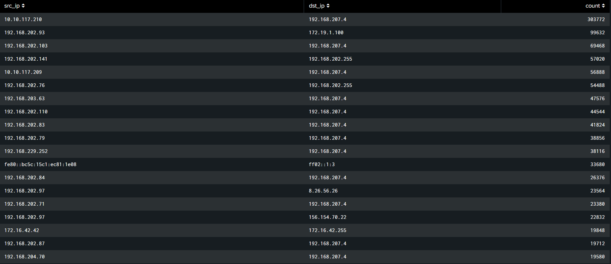

#  DNS Log Analysis with Splunk SIEM

This project presents a Splunk-based dashboard for analyzing DNS log data [`dns_log/`](https://github.com/sanjanamarri2521/DNS_Log_Analysis/tree/main/dns_log) to uncover insights into DNS traffic, identify anomalies, and detect potentially suspicious behavior.

By using Splunk SPL (Search Processing Language), the dashboard provides visibility into how DNS is being used across a network — including which internal hosts are making the most queries, which domains are being queried most often, and patterns that may indicate security concerns such as beaconing or tunneling.

---

## Dashboard Visualizations

Each panel below uses SPL queries to create a meaningful visualization. Add your screenshots to the `dashboard_screenshots/` folder and replace the placeholders with actual paths once uploaded.

---

### 1. Top DNS Sources  
 
Displays the most queried domains and their associated source IPs.

---

###  2. Top DNS Source IPs  

Shows the top internal IPs generating DNS queries.

---

###  3. Unusual DNS Record Types  
  
Surfaces queries for uncommon or potentially suspicious DNS record types.

---

###  4. DNS Queries by Record Type  
 
Visual breakdown of DNS queries by record type (e.g., A, AAAA, CNAME, TXT).

---

###  5. DNS Activity  

Shows overall frequency of queried domains across all indexes.

---

###  6. Top DNS Destination IPs  
 
Highlights which DNS servers are receiving the most queries.

---

###  7. High-Frequency Queried Domains (Potential Anomalies)  

Identifies domains queried excessively, indicating possible malicious activity.

---

###  8. DNS Records Over Time  

Tracks how often each record type is queried over time.

---

### 9. DNS Queries by Source and Destination IP Pair  
 
Maps internal IPs to the DNS servers they query, useful for spotting patterns or outliers.

---

##  Use Cases

- Detect abnormal DNS behavior  
- Identify potentially compromised hosts  
- Visualize domain resolution trends  
- Investigate internal DNS usage

---

## License

This project is licensed under the MIT License. See the [LICENSE](LICENSE) file for details.

---

##  Acknowledgment

This project was inspired by and adapted from:

**[Splunk Projects for Beginners – Project #1: Analyzing DNS Logs using Splunk SIEM](https://github.com/0xrajneesh/Splunk-Projects-For-Beginners/blob/main/Project%231-analyzing-dns-log-using%20splunk-siem.md)**  
by [0xrajneesh](https://github.com/0xrajneesh)

Huge thanks to the author for making beginner-friendly Splunk projects available to the community!

---
